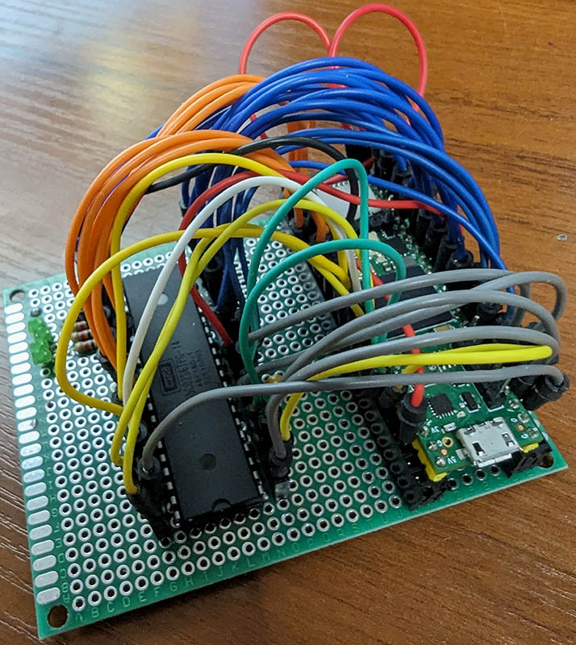

# W65C02-Serial port bridge for Teensy 4.1

This project is a simple bridge between [W65C02 CPU](https://westerndesigncenter.com/wdc/documentation/w65c02s.pdf)
and a serial port, implemented for [Teensy 4.1](https://www.pjrc.com/store/teensy41.html) development board.

The main purpose of this project is to provide cycle-by-cycle debugging capabilities to W65C02, but it can serve
other purpose too, i.e.:

- __Comparative debugging for emulators__:
  You can run your 6502-family emulator in parallel with an actual CPU to compare the results
  in order to measure the accuracy of your emulator.
- __Emulated 8-bit computers with a physical processor__:
  You can implement an emulator of an 8-bit, 6502-based computer (i.e. C64), that will work
  (via this bridge) with a real CPU, while other components of the system (like RAM, ROM,
  video chip) remain emulated
  (something like [Neo 6502](https://www.olimex.com/Products/Retro-Computers/Neo6502/open-source-hardware)).

## Content of this repo

- C++ code for Teensy 4.1 that enables full control over W65C02 CPU via serial port.
- [Examples](./examples/) (in C++ and Rust) demonstrating how to use the Bridge from a program running on a
  computer.
- Explanation how to wire Teensy with W65C02 on a breadboard.
- Complete [PCB design and schematics](./pcb/) (with some extra features).

## Wiring

The W65C02 CPU is a 40-pin chip, with 37 data pins (2 pins are for
power/ground and pin 35 is unused). As Teensy board is equipped with 41 digital input/output pins,
and allows for serial connection via USB, it seems to be a perfect match for this project.
It is very simple to create this bridge on a breadboard.

Below there is a pinout diagram of the W65C02 CPU

```text
            +------------+
    VP/ <-- |  1      40 | <-- RES/
    RDY <-> |  2      39 | --> PHI2O
  PHI1O <-- |  3      38 | <-- SO/
   IRQ/ --> |  4      37 | <-- PHI2
    ML/ <-- |  5     @36 | <-- BE
   NMI/ --> |  6      35 | --- NC
   SYNC <-- |  7     *34 | --> RW/
    VDD --> |  8     *33 | <-> D0
     A0 <-- |  9*    *32 | <-> D1
     A1 <-- | 10*    *31 | <-> D2
     A2 <-- | 11*    *30 | <-> D3
     A3 <-- | 12*    *29 | <-> D4
     A4 <-- | 13*    *28 | <-> D5
     A5 <-- | 14*    *27 | <-> D6
     A6 <-- | 15*    *26 | <-> D7
     A7 <-- | 16*    *25 | --> A15
     A8 <-- | 17*    *24 | --> A14
     A9 <-- | 18*    *23 | --> A13
    A10 <-- | 19*    *22 | --> A12
    A11 <-- | 20*     21 | --> GND
            +------------+

    * - tri-state pin,   @ - async,  / - active on low
```

### Default configuration

The table below illustrates the default configuration of this project.
In order to adjust the pin mapping, modify the `PINS_MAP` macro definition in the
[configuration file](./configuration.h).

The pin assignemt is organised the way, that it leaves one SPI interface
available, that can be used for additional device (i.e. the [PCB](./pcb/)
gives the option to connect ILI9341 screen). 

| Teensy pin | CPU pin | CPU pin name | ←  → | CPU Pin name  | CPU pin | Teensy pin |
| ---------- | ------- | ------------ | ---- | ------------- | ------- | ---------- |
| 0          | 1       | Vector pull  |      | Reset         | 40      | 23         |
| 21         | 2       | Ready        |      | PHI2O         | 39      | 22         |
| 2          | 3       | PHI1O        |      | Set overflow  | 38      | 20         |
| 3          | 4       | IRQ          |      | PHI2          | 37      | 13         |
| 4          | 5       | Memory lock  |      | Bus enable    | 36      | 19         |
| 5          | 6       | NMI          |      | No connection | 35      |            |
| 6          | 7       | SYNC         |      | Read/Write    | 34      | 17         |
| 3.3V       | 8       | VDD          |      | D0            | 33      | 16         |
| 7          | 9       | A0           |      | D1            | 32      | 15         |
| 8          | 10      | A1           |      | D2            | 31      | 14         |
| 9          | 11      | A2           |      | D3            | 30      | 41         |
| 11         | 12      | A3           |      | D4            | 29      | 40         |
| 12         | 13      | A4           |      | D5            | 28      | 39         |
| 24         | 14      | A5           |      | D6            | 27      | 38         |
| 25         | 15      | A6           |      | D7            | 26      | 37         |
| 28         | 16      | A7           |      | A15           | 25      | 36         |
| 29         | 17      | A8           |      | A14           | 24      | 35         |
| 30         | 18      | A9           |      | A13           | 23      | 34         |
| 31         | 19      | A10          |      | A12           | 22      | 33         |
| 32         | 20      | A11          |      | Ground        | 21      | GND        |

### Minimal configuration

In the minimalistic configuration the following CPU pins must be connected to the board:

- `A0-A15` - address bus (inputs)
- `D0-D7` - data bus (input or output)
- `RW` - read/write input; it informs whether the data bus is in read (high) or write (low) state
- `PHI2` - clock signal input
- `GND` - ground, should be connected to Teensy's ground pin
- `VDD` - power; should be connected to Teensy's 3.3V pin

In such configuration `RES`, `IRQ`, `NMI` and `BE` and `RDY` pins must be also connected to 3.3V,
ideally via 1k resistor.

Please note that the `RES` (pin 40) must be kept low for at least two cycles on power on.
The bridge handles it programmatically, but if your intention is to not connect RST pin to
Teensy or to have a physical control over the reset state (i.e. in case of power failure),
then the best option is to connect the pin via
[DS1818 Econo Reset](https://www.mouser.co.uk/datasheet/2/609/DS1818-3122611.pdf)

### Example



The photo shows wiring on solderable prototype board (a regular breadbord could be used instead). 
All CPU pins are connected to Teensy, apart the pin 35 (NC).
The CPU pin 8 (VDD) is connected via [decoupling capacitor](https://en.wikipedia.org/wiki/Decoupling_capacitor).
Additionally, there are some LEDs to indicate some of the signals.

### Warning

Incorrect connection may damage the CPU or the development board. Please take extra attention to the
correctness of your wiring, and double-check it before powering up your board.

## Compilation and execution

### With Arduino IDE and Teensyduino

1. Install [Arduino IDE](https://www.arduino.cc/en/software)
1. Install and configure [Teensyduino](https://www.pjrc.com/teensy/teensyduino.html)
1. Clone this project into your Arduino sketches folder (usually `~/Arduino/sketches`)
1. Click menu `Sketch / Compile` to compile
1. Click menu `Sketch / Upload` tu upload to Teensy board

### With Arduino CLI

Follow [this post](https://forum.pjrc.com/index.php?threads/arduino-cli-and-ide-now-released-teensy-supported.53548/page-5#post-299430) to see how to configure Arduino CLI with Teensy.

- to compile: `make build`
- to upload `make upload`

Make sure that the port name in `Makefile` is the correct one. To find the port name execute
`arduino-cli board list`. You must have Teensy connected to your computer to have the port visible.

##### Install Arduino CLI and dependencies with Nix and Direnv

If you are not using Nix packages, then you don't know how much you miss in terms of convenience and reproducible dev environments - [start](https://nixos.org/download) today :-)

1. Clone the repo and cd project's directory
1. If you use [Direnv](https://direnv.net/), just execute `direnv allow`, otherwise type `nix-shell`
1. Wait until all dependencies download and configure
1. You can now use `make build` and `make upload`
1. I've added [`treefmt`](https://github.com/numtide/treefmt) to dependencies, so you can format the
   code after changes by executing `treefmt`

## Example

There is complete example program in the [examples folder](./examples), that demonstrates
how to execute 6502 binary with the bridge and RAM emulated on the host machine
(not on Teensy). See the [Readme file](.examples/README.md) for details.

## Data structure and message protocol

The communication "protocol" is very simple - every message sent to and going from serial port contains the status of all 40 CPU pins (one per bit). 
Imagine that the CPU pins representaion is a 40-bit number, with Pin 1 representing the least significant bit (bit 0) and Pin 40 - the most significant 
bit. In practice that number is being transferred via serial port as buffer of 5 bytes in [big-endian](https://en.wikipedia.org/wiki/Endianness) format,
so byte 0 contains the status of pins 40 to 33 (reading bits left-to-right), etc. The table below illustrates the exact structure of a message.

| Byte | Bit 7  | Bit 6  | Bit 5  | Bit 4  | Bit 3  | Bit 2  | Bit 1  | Bit 0  |
|----- | ------ | ------ | ------ | ------ | ------ | ------ | ------ | ------ |
| 0    | Pin 40<br>`RES/` | Pin 39<br>`PHI2O`| Pin 38<br>`SO/` | Pin 37<br>`PHI2`| Pin 36<br>`BE`  | Pin 35<br>`NC`  | Pin 34<br>`RW/` | Pin 33<br>`D0`  |
| 1    | Pin 32<br>`D1`   | Pin 31<br>`D2`   | Pin 30<br>`D3`  | Pin 29<br>`D4`  | Pin 28<br>`D5`  | Pin 27<br>`D6`  | Pin 26<br>`D7`  | Pin 25<br>`A15` |
| 2    | Pin 24<br>`A14`  | Pin 23<br>`A13`  | Pin 22<br>`A12` | Pin 21<br>`VSS` | Pin 20<br>`A11` | Pin 19<br>`A10` | Pin 18<br>`A9`  | Pin 17<br>`A8`  |
| 3    | Pin 16<br>`A7`   | Pin 15<br>`A6`   | Pin 14<br>`A5`  | Pin 13<br>`A4`  | Pin 12<br>`A3`  | Pin 11<br>`A2`  | Pin 10<br>`A1`  | Pin  9<br>`A0`  |
| 4    | Pin  8<br>`VDD`  | Pin  7<br>`SYNC` | Pin  6<br>`NMI/`| Pin  5<br>`ML/` | Pin  4<br>`IRQ/`| Pin 3<br>`PHI1O`| Pin  2<br>`RDY` | Pin  1<br>`VP/` |

### Messaging order
As the Teensy Bridge doesn't implement a clock, the communication must start on the host side - that means the host is responsible for
sending `PHI2` values (pin 37), and - in order to make the CPU to _tick_ - the value must be inverted for every data package being sent from
the host. 

Every write to the Teensy Bridge must be followed by a read, even if we are not planning to use the data from the Bridge
(typical request-response approach). 
That can be understood as follows: every single half-cycle (the cpu phase), consist of write to serial port followed by a read.
A full CPU cycle will consit of write-read-write-read operations, with pin 37 being set to 0 for the first time and 1 for second.

When the CPU is in the first half-cycle, it executes internal operations, resulting in setting address bus and the `RW\` pin. 
The 2nd half-cycle is a _memory cycle_, when the CPU writes or reads its data pins. The algorithm below demonstrates the 
the typical interaction with the CPU, respecting both CPU phases. 

1. First half-cycle
    1. Set `PHI2` pin to LOW (0)
    2. Write buffer to serial port
    3. Read buffer from serial port
    4. Extract address and read/write state (pin 34) from the buffer
2. Second half-cycle
    1. Set `PHI2` pin to HIGH (1)
    2. In case of read operation (pin 34 is high) - read the value from the memory and set the data pins.
    3. Write buffer to serial port
    4. Read buffer from serial port
    5. In case of write operation (pin 34 was low in the first half-cycle) - read the value from data pins and save in the memory.  


## Working with other CPUs from the 6502 family

This project is meant to work specifically with W65C02 CPU. The main reason
is that W65C02 is static, that means it can be easily step-by-step cycled at any speed,
that is very useful in case of debugging. Some other CPUs, like C64's MOS6510, have
limitations of a minimum speed (~100kHz).

The project should work fine with other CPUs from WDC family, especially with  
65C802, due to pin layout compatibility. Although untested, the 65C802 should work
as is without any changes in the current code.

There is plan to make the project fully compatible with W65C816, however that
requiresd some changed in handling 24-bit address bus (there is already a 
[ticket](https://github.com/ddrcode/teensy_6502_bridge/issues/3) for that).

This bridge may still work with some CPUs from the 6502 family, but some adjustments
may need to be required, as the other processor may have different pin layout. Also,
the minimum speed requirement may be a blocker here, due to limited speed of the bridge itself
(see the section below).

## Speed limitations

The speed of the bridge is limited by the speed of the serial port. The bridge sends 40-bits of data
both directions for every single half-cycle (clock phase). In order to obtain the CPU speed of
1MHz, it would require the serial port operating at 160Mbit/s. Although the Teensy 4.1 is equipped
with high-speed USB 2.0 port, that - in theory - allows for 480Mbit/s, in reality the serial port
emulation uses a single USB channel only and there is an overhead related
to creation of USB packages. The current speed I've achieved in my tests is around
0.5Mbit/s. This is quite sufficient for any form of debugging and execution of test programs,
but definitely too slow in case of running any real-time applications.
In example starting the C64 Kernal via the bridge takes around 300 seconds.

I've created a [ticket](#8) for this issue. Contributors are welcome!

## References

- [W65C02 datasheet](https://westerndesigncenter.com/wdc/documentation/w65c02s.pdf)
- [Teensy 4.1](https://www.pjrc.com/store/teensy41.html)
- [6502 Primer: What do I do with the "mystery" pins](https://wilsonminesco.com/6502primer/MysteryPins.html)
