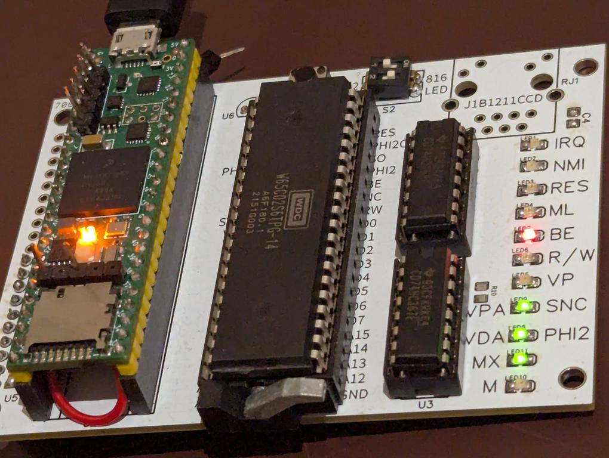
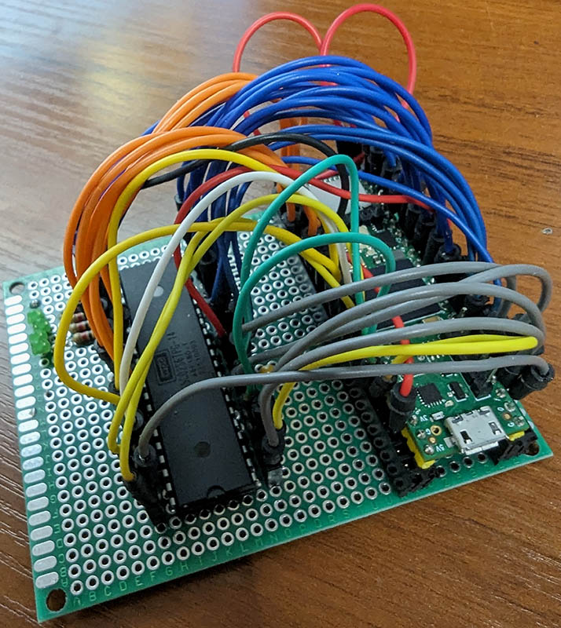
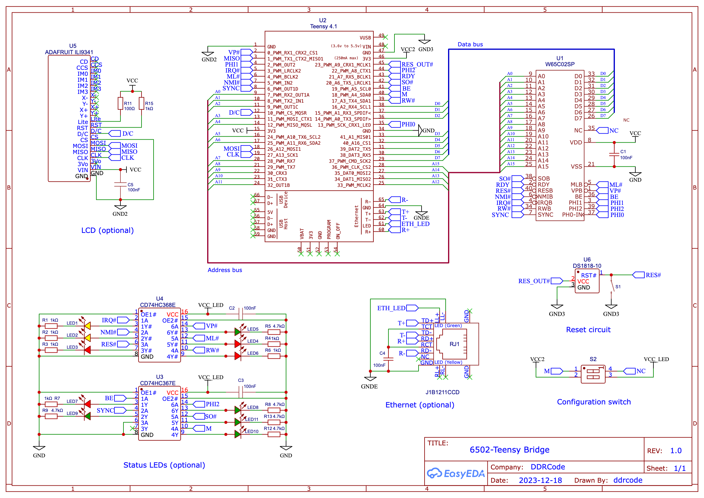

# W65C02-Serial port bridge for Teensy 4.1

This project is a simple bridge between the [W65C02 CPU](https://westerndesigncenter.com/wdc/documentation/w65c02s.pdf)
and a serial port, implemented for the [Teensy 4.1](https://www.pjrc.com/store/teensy41.html) development board.

The main purpose of this project is to provide cycle-by-cycle debugging capabilities for the W65C02, but it can serve
other purposes too, e.g.:

- __Comparative debugging for emulators__:
  You can run your 6502-family emulator in parallel with an actual CPU and compare the results
  in order to measure the accuracy of your emulator.
- __Emulated 8-bit computers with a physical processor__:
  You can implement an emulator of an 8-bit, 6502-based computer (e.g. the C64) that works
  (via this bridge) with a real CPU, while the other components of the system (like RAM, ROM,
  or the video chip) remain emulated
  (something like the [Neo 6502](https://www.olimex.com/Products/Retro-Computers/Neo6502/open-source-hardware)).



## Content of this repo

- C++ code for the Teensy 4.1 that enables full control over the W65C02 CPU via a serial port.
- [Examples](./examples/) (in C++ and Rust) demonstrating how to use the bridge from a program running on a
  computer.
- Host-side tooling plus unit/integration tests that exercise the serial protocol and pin-handling logic.
- An explanation of how to wire the Teensy to the W65C02 on a breadboard.
- Complete [PCB design and schematics](./pcb/) (with some extra features).
- [Documentation](./docs/): the [protocol specification](./docs/protocol.md), development guides for
  [C++](./docs/development-guide-cpp.md) and [Rust](./docs/development-guide-rust.md), and a
  [macOS guide](./docs/macos.md).

## Wiring

The W65C02 CPU is a 40-pin chip with 37 signal pins (2 pins are for
power/ground and pin 35 is unused). As the Teensy board is equipped with more than 40 digital
input/output pins and allows for a serial connection via USB, it seems to be a perfect match for this
project. It is very simple to create this bridge on a breadboard.

Below is a pinout diagram of the W65C02 and the Teensy, as well
as the mapping between the CPU and Teensy pins.

```text
                                                        Teensy 4.1
                                                     +--------------+
                W65C02                           --- | GND      VIN | ---
            +------------+                   VP/ --- |  0       GND | ---
    VP/ <-- |  1      40 | <-- RES/              --- |  1      3.3V | ---
    RDY <-> |  2      39 | --> PHI2O       PHI1O --- |  2        23 | --- RES/
  PHI1O <-- |  3      38 | <-- SO/          IRQ/ --- |  3        22 | --- PHI2O
   IRQ/ --> |  4      37 | <-- PHI2          ML/ --- |  4        21 | --- RDY
    ML/ <-- |  5     @36 | <-- BE           NMI/ --- |  5        20 | --- SO/
   NMI/ --> |  6      35 | --- NC           SYNC --- |  6        19 | --- BE
   SYNC <-- |  7     *34 | --> RW/            A0 --- |  7        18 | ---
    VDD --> |  8     *33 | <-> D0             A1 --- |  8        17 | --- RW/
     A0 <-- |  9*    *32 | <-> D1             A2 --- |  9        16 | --- D0
     A1 <-- | 10*    *31 | <-> D2                --- | 10        15 | --- D1
     A2 <-- | 11*    *30 | <-> D3             A3 --- | 11        14 | --- D2
     A3 <-- | 12*    *29 | <-> D4             A4 --- | 12        13 | --- PHI2
     A4 <-- | 13*    *28 | <-> D5            VDD --- | 3.3V     GND | --- GND
     A5 <-- | 14*    *27 | <-> D6             A5 --- | 24        41 | --- D3
     A6 <-- | 15*    *26 | <-> D7             A6 --- | 25        40 | --- D4
     A7 <-- | 16*    *25 | --> A15               --- | 26        39 | --- D5
     A8 <-- | 17*    *24 | --> A14               --- | 27        38 | --- D6
     A9 <-- | 18*    *23 | --> A13            A7 --- | 28        37 | --- D7
    A10 <-- | 19*    *22 | --> A12            A8 --- | 29        36 | --- A15
    A11 <-- | 20*     21 | --> GND            A9 --- | 30        35 | --- A14
            +------------+                   A10 --- | 31        34 | --- A13
                                             A11 --- | 32        33 | --- A12
    * - tri-state pin,                               +--------------+
    @ - async,
    / - active on low
```

### Default configuration

The table below (and the pinout above) illustrates the default configuration of the project.
To adjust the pin mapping, modify the `PINS_MAP` macro definition in the
[configuration file](./configuration.h).

The pin assignment is organized so that it leaves one SPI interface
available (pins 1, 10, 26 and 27), which can be used for an additional device (e.g. the [PCB](./pcb/)
gives the option to connect an ILI9341 screen).

| Teensy pin | CPU pin | CPU pin name | ←  → | CPU Pin name  | CPU pin | Teensy pin |
| ---------- | ------- | ------------ | ---- | ------------- | ------- | ---------- |
| 0          | 1       | Vector pull  |      | Reset         | 40      | 23         |
| 21         | 2       | Ready        |      | PHI2O         | 39      | 22         |
| 2          | 3       | PHI1O        |      | Set overflow  | 38      | 20         |
| 3          | 4       | IRQ          |      | PHI2          | 37      | 13         |
| 4          | 5       | Memory lock  |      | Bus enable    | 36      | 19         |
| 5          | 6       | NMI          |      | No connection | 35      |            |
| 6          | 7       | SYNC         |      | Read/Write    | 34      | 17         |
| 3.3V       | 8       | VDD          |      | D0            | 33      | 16         |
| 7          | 9       | A0           |      | D1            | 32      | 15         |
| 8          | 10      | A1           |      | D2            | 31      | 14         |
| 9          | 11      | A2           |      | D3            | 30      | 41         |
| 11         | 12      | A3           |      | D4            | 29      | 40         |
| 12         | 13      | A4           |      | D5            | 28      | 39         |
| 24         | 14      | A5           |      | D6            | 27      | 38         |
| 25         | 15      | A6           |      | D7            | 26      | 37         |
| 28         | 16      | A7           |      | A15           | 25      | 36         |
| 29         | 17      | A8           |      | A14           | 24      | 35         |
| 30         | 18      | A9           |      | A13           | 23      | 34         |
| 31         | 19      | A10          |      | A12           | 22      | 33         |
| 32         | 20      | A11          |      | Ground        | 21      | GND        |

### Minimal configuration

In the minimal configuration, the following CPU pins must be connected to the board:

- `A0-A15` - address bus (inputs)
- `D0-D7` - data bus (input or output)
- `RW` - read/write input; it indicates whether the data bus is in read (high) or write (low) state
- `PHI2` - clock signal input
- `GND` - ground, should be connected to a Teensy ground pin
- `VDD` - power; should be connected to the Teensy's 3.3V pin

In such a configuration the `RES`, `IRQ`, `NMI`, `BE` and `RDY` pins must also be connected to 3.3V,
ideally via a 1k resistor.

Please note that `RES` (pin 40) must be kept low for at least two cycles on power-on.
The bridge handles it programmatically, but if you intend not to connect the RES pin to the
Teensy, or want physical control over the reset state (e.g. in case of a power failure),
the best option is to drive the pin with a
[DS1818 Econo Reset](https://www.mouser.co.uk/datasheet/2/609/DS1818-3122611.pdf).

### Example

The photo shows the wiring on a solderable prototype board (a regular breadboard could be used instead).
All CPU pins are connected to the Teensy, apart from pin 35 (NC).
The CPU pin 8 (VDD) is connected via a [decoupling capacitor](https://en.wikipedia.org/wiki/Decoupling_capacitor).
Additionally, there are some LEDs indicating selected signals.



### Schematic and extended configuration

The schematic below illustrates the connectivity between the Teensy and the CPU, but also
provides some optional extras:

- a reset button
- indication LEDs
- SPI connectivity with an ILI9341 LCD.
  

### Warning

An incorrect connection may damage the CPU or the development board. Please pay extra attention to the
correctness of your wiring and double-check it before powering up your board.

## Compilation and execution

### With Arduino IDE and Teensyduino

1. Install the [Arduino IDE](https://www.arduino.cc/en/software)
1. Install and configure [Teensyduino](https://www.pjrc.com/teensy/teensyduino.html)
1. Clone this project into your Arduino sketches folder (usually `~/Arduino/sketches`)
1. Click menu `Sketch / Compile` to compile
1. Click menu `Sketch / Upload` to upload to the Teensy board

### With Arduino CLI

Follow [this
post](https://forum.pjrc.com/index.php?threads/arduino-cli-and-ide-now-released-teensy-supported.53548/page-5#post-299430)
to see how to configure the Arduino CLI for Teensy, or do these steps (the third one is for Linux only):

```
arduino-cli config add board_manager.additional_urls https://www.pjrc.com/teensy/package_teensy_index.json
arduino-cli core install teensy:avr
wget https://www.pjrc.com/teensy/00-teensy.rules -P /etc/udev/rules.d
```

- to compile: `make build`
- to upload: `make upload`

`make upload` uses `teensy-loader-cli`, so the Teensy Loader application must be available on your PATH.

On macOS `make upload` may fail with `Device is in use by "dummy" driver`, and the serial
ports are named differently — see [Running the bridge on macOS](./docs/macos.md) for
working upload options and other Darwin-specific details.

### Running the host-side runners

After flashing the firmware you can exercise the bridge directly from your workstation. Both host examples
share the same CLI flags; at minimum you must provide the serial `--port` and the path to a 6502 binary via
`--program`. When you invoke the Makefile targets, the `PROGRAM` variable defaults to `examples/test.p`, and you
can point it somewhere else as needed.

The Makefile exposes convenience targets that forward those flags for you:

```bash
PORT=/dev/ttyACM0 make run-cpp   # builds and runs the C++ host runner
PORT=/dev/ttyACM0 make run-rust  # builds and runs the Rust host runner (cargo)
PROGRAM=examples/other.bin PORT=/dev/ttyACM0 make run-cpp
```

Pass `--halfcycles` to either executable if you want to log both halves of the clock and show the PHI pins in the
log output. Run `arduino-cli board list` whenever you need to confirm which `/dev/tty*` entry corresponds to the
Teensy (on macOS the port appears as `/dev/cu.usbmodem*` — see [docs/macos.md](./docs/macos.md)).

##### Install Arduino CLI and dependencies with Nix and Direnv

If you are not using Nix packages, then you don't know how much you are missing in terms of convenience and reproducible dev environments - [start](https://nixos.org/download) today :-)

1. Clone the repo and cd into the project's directory
1. If you use [Direnv](https://direnv.net/), just execute `direnv allow`; otherwise type `nix-shell`
1. Wait until all the dependencies download and configure
1. You can now use `make build` and `make upload`
1. I've added [`treefmt`](https://github.com/numtide/treefmt) to the dependencies, so you can format the
   code after changes by executing `treefmt`

## Example

There is a complete example program in the [examples folder](./examples) that demonstrates
how to execute a 6502 binary with the bridge and RAM emulated on the host machine
(not on the Teensy). See the [Readme file](./examples/README.md) for details.

## Data structure and message protocol

The host and the bridge exchange short, framed messages over the serial port: a type byte, a
payload and a checksum. In normal operation both sides exchange 7-byte _pins messages_ carrying
the state of all 40 CPU pins (one per bit) - one request-response pair per clock half-cycle, with
the host driving `PHI2` and emulating the memory. The bridge validates every incoming message and
responds with a short error message when it rejects one.

The complete specification - the message framing, the exact bit layout of the pins payload, the
messaging order and the timing characteristics - lives in [docs/protocol.md](./docs/protocol.md).

## Working with other CPUs from the 6502 family

This project is meant to work specifically with the W65C02 CPU. The main reason
is that the W65C02 is static, which means it can easily be cycled step by step at any speed -
very useful for debugging. Some other CPUs, like the C64's MOS6510, have
a minimum clock speed limitation (~100 kHz).

The project should work fine with other CPUs from the WDC family, especially with the
65C802, due to pin layout compatibility. Although untested, the 65C802 should work
as-is, without any changes to the current code.

There is a plan to make the project fully compatible with the W65C816, however that
requires some changes in the handling of the 24-bit address bus (there is already a
[ticket](https://github.com/ddrcode/teensy_6502_bridge/issues/3) for that).

This bridge may still work with some other CPUs from the 6502 family, but some adjustments
may be required, as those processors may have different pin layouts. Also,
a minimum clock speed requirement may be a blocker, due to the limited speed of the bridge itself
(see the section below). And finally - the WDC family processors work perfectly at 3V, which matches
the Teensy 4.1 pin voltage. Other processors, like the original 6502/6510, may be 5V-only.
That would require further modifications.

## Speed limitations

The speed of the bridge is limited by the speed of the serial port. The bridge sends 40 bits of data
in both directions for every single half-cycle (clock phase). To obtain a CPU speed of
1 MHz, the serial port would have to operate at 160 Mbit/s. Although the Teensy 4.1 is equipped
with a high-speed USB 2.0 port, which - in theory - allows for 480 Mbit/s, in reality the serial port
emulation uses a single USB channel only and there is an overhead related
to the creation of USB packets. The current speed I've achieved in my tests is around
0.5 Mbit/s. This is quite sufficient for any form of debugging and execution of test programs,
but definitely too slow for running any real-time applications.
For example, starting the C64 Kernal via the bridge takes around 300 seconds.

I've created a [ticket](https://github.com/ddrcode/teensy_6502_bridge/issues/8) for this issue.
Contributors are welcome!

## References

- [W65C02 datasheet](https://westerndesigncenter.com/wdc/documentation/w65c02s.pdf)
- [Teensy 4.1](https://www.pjrc.com/store/teensy41.html)
- [6502 Primer: What do I do with the "mystery" pins](https://wilsonminesco.com/6502primer/MysteryPins.html)
