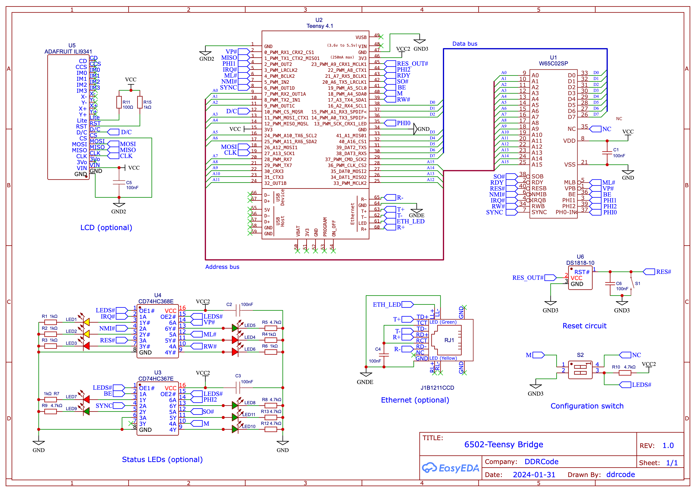
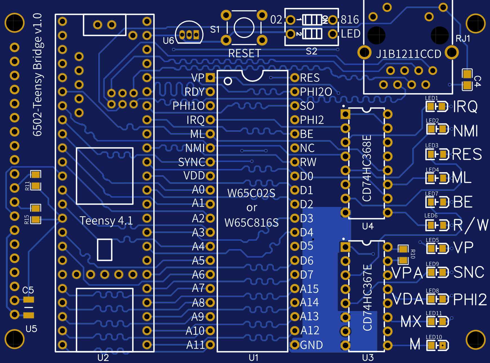

# PCB

This folder contains schematics, PCB files (Gerber) and list of components of 6502-Teensy Bridge.

## Schematics

## PCB Design

## BOM

### Mandatory components

| Ref | Component | Qty | Size | Description |
|-----|-----------|-----|------|-------------|
| U1 | W65C02 or W65C816 | 1 | PDIP-40 | CPU |
| U2 | Teensy 4.1 | 1 | | Microcontroller dev board |
| U6 | [DS1818-10](https://www.mouser.co.uk/datasheet/2/609/DS1818-3122611.pdf) | 1 | TO-92-3 | EconoReset with push button |
| C1 | 100nF | 1 | 0805 SMD | Unpolarized capacitor |
| S1 | TL1105 | 1 | 4 pin | Tactile switch |
| S2 | ADE | 1 | DIP-2 | 2-pos DIP switch |

### Optional components

#### Ethernet

| Ref | Component | Qty | Size | Description |
|-----|-----------|-----|------|-------------|
| RJ1 | J1B1211CCD | 1 | | RJ45 Socket |
| C4 | 100nF | 1 | 0805 SMD | Unpolarized capacitor |

#### Debugging LEDs

| Ref | Component | Qty | Size | Description |
|-----|-----------|-----|------|-------------|
| U3 | [CD74HC367E](https://www.ti.com/lit/ds/symlink/cd54hc368.pdf?ts=1706075936400) | 1 | PDIP-16 | Line driver |
| U4 | [CD74HC368E](https://www.ti.com/lit/ds/symlink/cd54hc368.pdf?ts=1706075936400) | 1 | PDIP-16 | Inverting line driver |
| C2,C3 | 100nF | 2 | 0805 SMD | Unpolarized capacitor |
| LED5, LED8-11 | Standard LED - SMD | 5 | 0805 SMD | Green LEDs |
| R5, R8-R11 | 4.7k Ohm | 5 | 0805 SMD | Resistors for green LEDs |
| LED3-4, LED6-7 | Standard LED - SMD | 4 | 0805 SMD | Red LEDs |
| R3-R4, R6-R7 | 3k Ohm | 4 | 0805 SMD | Resistors for red LEDs |
| LED1, LED2 | Standard LED - SMD | 2 | 0805 SMD | Yellow LEDs |
| R1, R2 | 4.7k Ohm | 2 | 0805 SMD | Resistors for yellow LEDs |

#### SPI Screen

| Ref | Component | Qty | Size | Description |
|-----|-----------|-----|------|-------------|
| U5 | [ADAFRUIT ILI9341](https://www.adafruit.com/product/1743) | 1 | PDIP-16 | 3.2", 320x200px SPI screen |
| C5 | 100nF | 1 | 0805 SMD | Unpolarized capacitor |
| R11 | 100 Ohm | 1 | 0805 SMD | Screen light resistor |
| R15 | 1k Ohm | 1 | 0805 SMD | Screen reset resistor |
